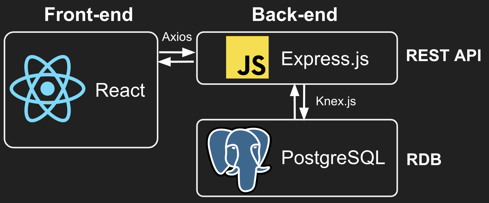
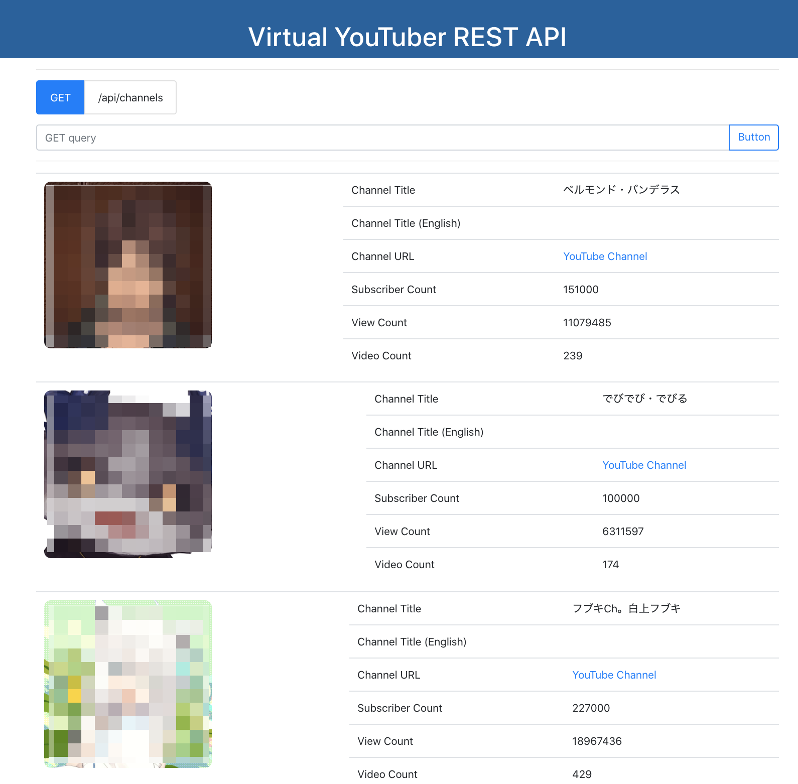
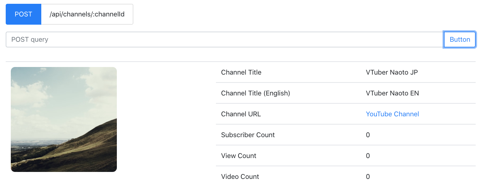

# Virtual YouTuber REST API

**This was created during my time as a student at [Code Chrysalis](https://www.codechrysalis.io/).**

Virtual YouTuber (VTuber) API is the data collection of 700+ Virtual YouTuber channels. The raw data was gotten from [YouTube Data API v3](https://developers.google.com/youtube/v3) and then extracted the basic data for only Virtual TouTubers.

## Architecture



## Setup environment

### 1. PostgreSQL Database

You will need postgres installed. If you haven't installed it already, download and install the [PostgresApp](https://postgresapp.com/) and verify its working by running the command `psql` in your terminal.

Create a database for this project by running:

```bash
echo "CREATE DATABASE vtuber_api TEMPLATE template0 ENCODING 'UTF-8' LC_COLLATE 'ja_JP.UTF-8' LC_CTYPE 'ja_JP.UTF-8';" | psql
```

#### Migrations

```bash
cd Server
yarn run migrate
```

#### Seeds

```bash
cd Server
yarn run seed
```

### 2. Starting REST API server

```bash
cd Server
yarn dev
```

### 3. Starting Front-end server

```bash
cd Client/react-client
yarn start
```

## How to use API

### 1. Get the list of all Virtual YouTuber channels

| Method | URI           |
| ------ | ------------- |
| GET    | /api/channels |

#### Example

```json
[
    {
    "id": 1099,
    "channel_title_jp": "フブキCh。白上フブキ",
    "channel_title_en": "Shirakami Fubuki",
    "channel_id": "UCdn5BQ06XqgXoAxIhbqw5Rg",
    "channel_url": "https://youtube.com/channel/UCdn5BQ06XqgXoAxIhbqw5Rg",
    "thumbnail":
    "https://yt3.ggpht.com/a/AGF-l7-oeSvjxgdwMoDyT1LMH8nyqkWJCZH8MAOjzg=s800-c-k-c0xffffffff-no-rj-mo",
    "view_count": 18967436,
    "subscriber_count": 227000,
    "video_count": 429
    },
    ...
]
```

### 2. Post a new Virtual YouTuber channel to API

| Method | URI                      |
| ------ | ------------------------ |
| POST   | /api/channels/:channelId |

#### Example

```json
{
  "channel_title_jp": "TEST YouTuber",
  "channel_title_en": "TEST YouTuber (English)",
  "channel_id": "XXXXXXXXXXXXXXXXXXXXXXXX",
  "thumbnail": "https://XYZ.com/xxxyyyzzz.png"
}
```

### 3. Modify a given Virtual YouTuber channel

| Method | URI                      |
| ------ | ------------------------ |
| PATCH  | /api/channels/:channelId |

#### Example

```json
{
  "channel_title_jp": "MOD YouTuber",
  "channel_title_en": "MOD YouTuber (English)",
  "channel_id": "MOD_XYZ",
  "thumbnail": "https://MOD.com/xxxyyyzzz.png"
}
```

### 4. Delete a given Virtual YouTuber channel from API

| Method | URI                      |
| ------ | ------------------------ |
| DELETE | /api/channels/:channelId |

## DEMO: Front-end App

### 1. Get the list of all Virtual YouTuber channels



### 2. Post a new Virtual YouTuber channel to API



## license

Copyright (c) 2019- Naoto Imamachi licensed under the MIT license.
